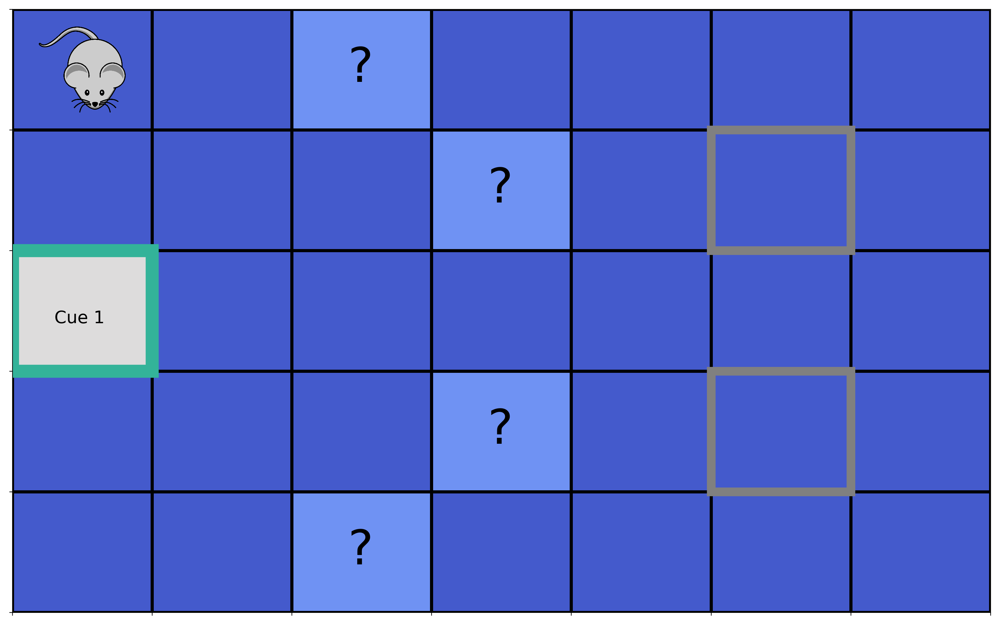
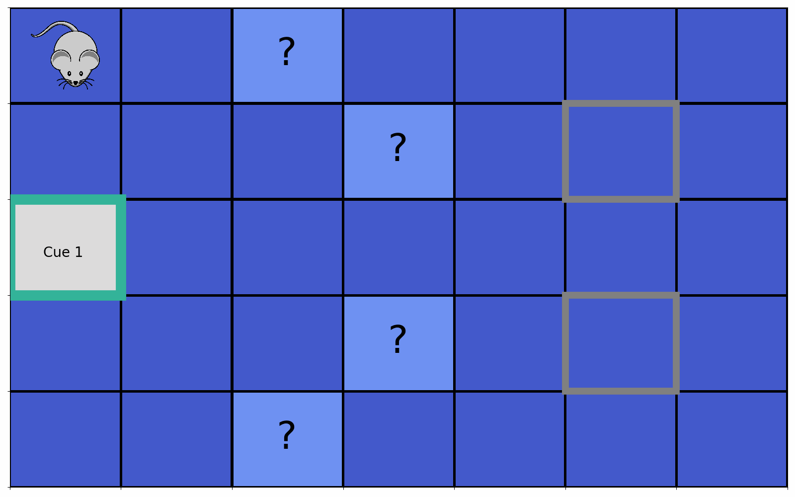

<p align='center'>
  <a href='https://github.com/infer-actively/pymdp'>
    
  </a> 
</p>

A Python package for simulating Active Inference agents in Markov Decision Process environments.
Please see our companion paper, published in the Journal of Open Source Software: ["pymdp: A Python library for active inference in discrete state spaces"](https://joss.theoj.org/papers/10.21105/joss.04098) for an overview of the package and its motivation. For a more in-depth, tutorial-style introduction to the package and a mathematical overview of active inference in Markov Decision Processes, see the [longer arxiv version](https://arxiv.org/abs/2201.03904) of the paper.

This package is hosted on the [`infer-actively`](https://github.com/infer-actively) GitHub organization, which was built with the intention of hosting open-source active inference and free-energy-principle related software.

Most of the low-level mathematical operations are [NumPy](https://github.com/numpy/numpy) ports of their equivalent functions from the `SPM` [implementation](https://www.fil.ion.ucl.ac.uk/spm/doc/) in MATLAB. We have benchmarked and validated most of these functions against their SPM counterparts.

## Status


[](https://pymdp-rtd.readthedocs.io/en/latest/?badge=latest)
[](https://doi.org/10.21105/joss.04098)


# ``pymdp`` in action

Here's a visualization of ``pymdp`` agents in action. One of the defining features of active inference agents is the drive to maximize "epistemic value" (i.e. curiosity). Equipped with such a drive in environments with uncertain yet disclosable hidden structure, active inference can ultimately allow agents to simultaneously learn about the environment as well as maximize reward.

The simulation below (see associated notebook [here](https://pymdp-rtd.readthedocs.io/en/latest/notebooks/cue_chaining_demo.html)) demonstrates what might be called "epistemic chaining," where an agent (here, analogized to a mouse seeking food) forages for a chain of cues, each of which discloses the location of the subsequent cue in the chain. The final cue (here, "Cue 2") reveals the location a hidden reward. This is similar in spirit to "behavior chaining" used in operant conditioning, except that here, each successive action in the behavioral sequence doesn't need to be learned through instrumental conditioning. Rather, active inference agents will naturally forage the sequence of cues based on an intrinsic desire to disclose information. This ultimately leads the agent to the hidden reward source in the fewest number of moves as possible.

You can run the code behind simulating tasks like this one and others in the **Examples** section of the [official documentation](https://pymdp-rtd.readthedocs.io/en/stable/).

<!-- 
<p align="center">
  
  
</p> -->

<!--  |  -->

<table><tr>
<td> 
  <p align="center" style="padding: 10px">
    
    <br>
    <em style="color: grey">Cue 2 in Location 1, Reward on Top</em>
  </p> 
</td>
<td> 
  <p align="center">
    
    <br>
    <em style="color: grey">Cue 2 in Location 3, Reward on Bottom</em>
  </p> 
</td>
</tr></table>

## Quick-start: Installation and Usage

In order to use `pymdp` to build and develop active inference agents, we recommend installing it with the the package installer [`pip`](https://pip.pypa.io/en/stable/), which will install `pymdp` locally as well as its dependencies. This can also be done in a virtual environment (e.g. with `venv`). 

When pip installing `pymdp`, use the package name `inferactively-pymdp`:

```bash
pip install inferactively-pymdp
```

Once in Python, you can then directly import `pymdp`, its sub-packages, and functions.

```bash

import pymdp
from pymdp import utils
from pymdp.agent import Agent

num_obs = [3, 5] # observation modality dimensions
num_states = [3, 2, 2] # hidden state factor dimensions
num_controls = [3, 1, 1] # control state factor dimensions
A_matrix = utils.random_A_matrix(num_obs, num_states) # create sensory likelihood (A matrix)
B_matrix = utils.random_B_matrix(num_states, num_controls) # create transition likelihood (B matrix)

C_vector = utils.obj_array_uniform(num_obs) # uniform preferences

# instantiate a quick agent using your A, B and C arrays
my_agent = Agent( A = A_matrix, B = B_matrix, C = C_vector)

# give the agent a random observation and get the optimized posterior beliefs

observation = [1, 4] # a list specifying the indices of the observation, for each observation modality

qs = my_agent.infer_states(observation) # get posterior over hidden states (a multi-factor belief)

# Do active inference

q_pi, neg_efe = my_agent.infer_policies() # return the policy posterior and return (negative) expected free energies of each policy as well

action = my_agent.sample_action() # sample an action

# ... and so on ...
```

## Getting started / introductory material

We recommend starting with the Installation/Usage section of the [official documentation](https://pymdp-rtd.readthedocs.io/en/stable/) for the repository, which provides a series of useful pedagogical notebooks for introducing you to active inference and how to build agents in `pymdp`.

For new users to `pymdp`, we specifically recommend stepping through following three Jupyter notebooks (can also be used on Google Colab):

- [`Pymdp` fundamentals](https://pymdp-rtd.readthedocs.io/en/latest/notebooks/pymdp_fundamentals.html)
- [Active Inference from Scratch](https://pymdp-rtd.readthedocs.io/en/latest/notebooks/active_inference_from_scratch.html)
- [The `Agent` API](https://pymdp-rtd.readthedocs.io/en/latest/notebooks/using_the_agent_class.html)

Special thanks to [Beren Millidge](https://github.com/BerenMillidge) and [Daphne Demekas](https://github.com/daphnedemekas) for their help in prototyping earlier versions of the [Active Inference from Scratch](https://pymdp-rtd.readthedocs.io/en/latest/notebooks/active_inference_from_scratch.html) tutorial, which were originally based on a grid world POMDP environment create by [Alec Tschantz](https://github.com/alec-tschantz).

We also have (and are continuing to build) a series of notebooks that walk through active inference agents performing different types of tasks, such as the classic [T-Maze environment](https://pymdp-rtd.readthedocs.io/en/latest/notebooks/tmaze_demo.html) and the newer [Epistemic Chaining](https://pymdp-rtd.readthedocs.io/en/latest/notebooks/cue_chaining_demo.html) demo.

## Contributing

This package is under active development. If you would like to contribute, please refer to [this file](CONTRIBUTING.md)

If you would like to contribute to this repo, we recommend using venv and pip
```bash
cd <path_to_repo_fork>
python3 -m venv env
source env/bin/activate
pip install -r requirements.txt
pip install -e ./ # This will install pymdp as a local dev package
```

You should then be able to run tests locally with `pytest`
```bash
pytest test
```

## Citing `pymdp`
If you use `pymdp` in your work or research, please consider citing our [paper](https://joss.theoj.org/papers/10.21105/joss.04098) (open-access) published in the Journal of Open-Source Software:

```
@article{Heins2022,
  doi = {10.21105/joss.04098},
  url = {https://doi.org/10.21105/joss.04098},
  year = {2022},
  publisher = {The Open Journal},
  volume = {7},
  number = {73},
  pages = {4098},
  author = {Conor Heins and Beren Millidge and Daphne Demekas and Brennan Klein and Karl Friston and Iain D. Couzin and Alexander Tschantz},
  title = {pymdp: A Python library for active inference in discrete state spaces},
  journal = {Journal of Open Source Software}
}
```

For a more in-depth, tutorial-style introduction to the package and a mathematical overview of active inference in Markov Decision Processes, you can also consult the [longer arxiv version](https://arxiv.org/abs/2201.03904) of the paper.

## Authors

- Conor Heins [@conorheins](https://github.com/conorheins)
- Alec Tschantz [@alec-tschantz](https://github.com/alec-tschantz)
- Beren Millidge [@BerenMillidge](https://github.com/BerenMillidge)
- Brennan Klein [@jkbren](https://github.com/jkbren)
- Arun Niranjan [@Arun-Niranjan](https://github.com/Arun-Niranjan)
- Daphne Demekas [@daphnedemekas](https://github.com/daphnedemekas)
